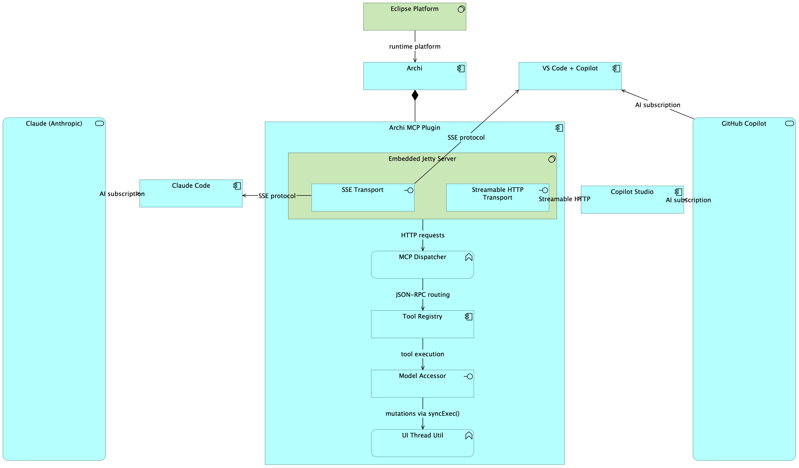

# Archi MCP Plugin

> **Status: Early Testing** — This plugin has been tested with Claude Code and GitHub Copilot in VS Code on macOS and Windows. It is functional but may have rough edges. Feedback, bug reports, and feature requests are very welcome — please open a [GitHub Issue](https://github.com/JesseLeresche/archi-mcp-server/issues).

An Eclipse OSGi plugin for [Archi](https://www.archimatetool.com/) that implements the [Model Context Protocol (MCP)](https://modelcontextprotocol.io/) over HTTP. Once installed, it starts an embedded MCP server on `localhost:7432` that lets any MCP-compliant AI assistant read and modify your open ArchiMate models in real time.

**No additional software required.** Unlike many MCP servers that require Node.js, Python, or a separate process to be running, this plugin is a single JAR that installs directly into Archi. Drop it in the `plugins/` folder, restart Archi, and it's ready — nothing else to install or configure.

## Architecture

> *This diagram was created, exported, and added to this README automatically by Claude Code using the Archi MCP Plugin.*



## Features

- **No extra dependencies** — single JAR bundles everything (Jetty 11 + Jackson); no Node.js, Python, or sidecar process needed
- **Multi-model support** — list all open models and switch between them
- **Query & filter** — search elements by type, layer, or name
- **Full model authoring** — create elements, relationships, views, and folders with optional folder placement
- **Type change** — change an element's ArchiMate type while preserving all relationships and view references
- **Visual layout** — place elements on views (including inside groups), draw connections, set positions and sizes
- **Appearance control** — change fill color, font color, line color, opacity, and line width
- **Property management** — update names, documentation, and custom key/value properties
- **Folder browsing** — get folder tree hierarchy, list folder contents (elements, relationships, views)
- **Folder management** — create folders and move elements, relationships, and views between folders
- **View management** — duplicate views with all figures, groups, notes, and connections; remove figures from views
- **View layout** — query figure positions and sizes on any view, including nested and grouped elements
- **Groups & notes** — full support for visual grouping elements and notes on views
- **Connection inspection** — get connection details including bendpoints, colors, and line width
- **Connection management** — update or delete visual connections on views
- **Access relationship support** — set access type (Read, Write, ReadWrite) on access relationships
- **Bulk operations** — create, update, or move multiple elements, relationships, or views in a single call
- **Bulk type change** — change the ArchiMate type of multiple elements in one call, preserving all references
- **Bulk view creation** — create multiple views in a single call
- **Bulk figure styling** — update appearance of multiple figures across views in one call
- **View editing** — update a view's name and documentation after creation
- **Connection inspection** — list all connections on a view with routing, bendpoints, and access types
- **BIAN SD Overview composite** — create a complete BIAN Service Domain Overview view (elements, relationships, figures, connections, styling) in one atomic call
- **Element analysis** — inspect an element's relationships and view usage
- **Token-efficient responses** — minimal JSON responses (no echoed inputs, no success flags, no derivable counts) to reduce LLM token usage by ~35-40%
- **View export** — export any view as a PNG image, returned inline via MCP and optionally saved to disk
- **Auto-layout** — hierarchical directed graph layout for views, with recursive nested container support and automatic container resizing
- **Model validation** — validate all relationships against the ArchiMate specification, with inline validation on relationship creation
- **Undo support** — all mutation tools integrate with Eclipse's CommandStack, enabling Ctrl+Z undo in Archi for MCP-driven changes
- **MCP image content** — tools can return image content blocks natively, enabling visual feedback to AI agents
- **Dual MCP transport** — SSE (Claude Code, VS Code Copilot) and Streamable HTTP (Copilot Studio)

## Tested With

| Client | Platform | Status |
|--------|----------|--------|
| [Claude Code](https://claude.ai/code) | macOS, Windows | Tested |
| GitHub Copilot (VS Code) | macOS, Windows | Tested |
| Copilot Studio | — | Untested — feedback welcome |

## Supported Clients

| Client | Transport |
|--------|-----------|
| [Claude Code](https://claude.ai/code) | SSE |
| GitHub Copilot (VS Code) | SSE |
| Copilot Studio | Streamable HTTP |

---

## Installation

### Option A — Use the pre-built release (recommended)

1. Download the latest JAR from the [Releases page](https://github.com/JesseLeresche/archi-mcp-server/releases).

2. Copy it into Archi's `plugins/` directory:

   **macOS**
   ```bash
   cp za.co.jesseleresche.archi.mcp-1.7.0.jar /Applications/Archi.app/Contents/Eclipse/plugins/
   ```

   **Linux**
   ```bash
   cp za.co.jesseleresche.archi.mcp-1.7.0.jar /opt/Archi/plugins/
   ```

   **Windows** (PowerShell)
   ```powershell
   Copy-Item za.co.jesseleresche.archi.mcp-1.7.0.jar "C:\Program Files\Archi\plugins\"
   ```

3. Restart Archi. The MCP server starts automatically.

4. Verify it's running:
   ```bash
   curl http://localhost:7432/health
   ```

### Option B — Build from source

See [Building Locally](#building-locally) below.

---

## Configuration for AI Clients

### Claude Code

Add to your project's `.mcp.json`, or to `~/.claude/claude_code_config.json` for global access:

```json
{
  "mcpServers": {
    "archi": {
      "type": "sse",
      "url": "http://localhost:7432/sse"
    }
  }
}
```

Restart Claude Code (or run `/mcp` to reload servers). Archi tools will appear automatically once a model is open in Archi.

### GitHub Copilot in VS Code

1. Open **Settings** (`Cmd+,` / `Ctrl+,`) and search for `mcp`.
2. Click **Edit in settings.json** under `github.copilot.chat.mcp.servers`.
3. Add the following entry:

```json
{
  "github.copilot.chat.mcp.servers": {
    "archi": {
      "type": "sse",
      "url": "http://localhost:7432/sse"
    }
  }
}
```

4. Reload VS Code. The Archi tools will be available in Copilot Chat when Agent mode is active (`@workspace` or `#tools`).

### Copilot Studio / Streamable HTTP

Use `POST http://localhost:7432/mcp` as the single-endpoint Streamable HTTP connector.

---

## Available Tools

### Model Management

| Tool | Description |
|------|-------------|
| `list_models` | List all open models with selection status |
| `select_model` | Switch active model by name or ID |

### Querying

| Tool | Description |
|------|-------------|
| `query_model` | Filter elements by ArchiMate type, layer, name, or folder |
| `get_views` | List diagram views with element, group, and note counts |

### Authoring

| Tool | Description |
|------|-------------|
| `create_element` | Create an ArchiMate element (optionally in a specific folder) |
| `create_relationship` | Create a relationship between two elements (with optional access type and folder) |
| `create_view` | Create an empty diagram view |
| `create_folder` | Create a folder or subfolder |

### Visual Layout & Appearance

| Tool | Description |
|------|-------------|
| `add_element_to_view` | Place an element as a figure on a view (optionally inside a group or parent) |
| `add_relationship_to_view` | Draw a visual connection for a relationship |
| `update_figure_appearance` | Set fill color, font color, line color, opacity, or line width on any figure (elements, groups, notes) |
| `get_view_layout` | Return position and size of all figures on a view, including nested elements, groups, and notes |
| `remove_figure_from_view` | Remove a visual figure (element, group, or note) from a view without deleting the underlying element |
| `duplicate_view` | Clone an existing view with all figures, groups, notes, connections, and appearance settings |
| `update_view` | Update a view's name and/or documentation |
| `layout_view` | Auto-layout all figures on a view using a hierarchical directed graph algorithm (recursive, handles nested containers) |

### Connections

| Tool | Description |
|------|-------------|
| `get_connection` | Get visual properties of a connection (bendpoints, colors, line width) |
| `get_view_connections` | List all connections on a view with relationship details, source/target figures, and bendpoints |
| `update_connection` | Update bendpoints, line color, line width, font color, or text position on a connection |
| `delete_connection` | Remove a visual connection from a view (logical relationship is preserved) |

### Properties & Analysis

| Tool | Description |
|------|-------------|
| `update_element` | Update name, documentation, custom properties, or ArchiMate type |
| `get_element_analysis` | Inspect relationships, view usage, and properties |
| `validate_model` | Validate all relationships against the ArchiMate specification, reporting violations with valid alternatives |

### Export

| Tool | Description |
|------|-------------|
| `export_view_as_image` | Export a view as a PNG image (returned inline and optionally saved to disk) |

### Composite

| Tool | Description |
|------|-------------|
| `create_sd_overview_view` | Create a complete BIAN SD Overview view with all elements, relationships, figures, connections, and styling in one atomic call |

### Folders

| Tool | Description |
|------|-------------|
| `get_folder_tree` | Get the complete folder hierarchy (optionally filtered by section) |
| `list_folder_contents` | List elements, relationships, views, and subfolders in a folder |
| `move_element_to_folder` | Move an element to a different folder |
| `move_view_to_folder` | Move a diagram view to a different folder |

### Deletion

| Tool | Description |
|------|-------------|
| `delete_element` | Delete an element and its relationships (cascade) |
| `delete_view` | Delete a diagram view |

### Bulk Operations

| Tool | Description |
|------|-------------|
| `bulk_create_elements` | Create multiple elements in one call (with optional per-item folder) |
| `bulk_update_elements` | Update multiple elements in one call (supports type changes with `new_type`) |
| `bulk_create_relationships` | Create multiple relationships in one call (with optional access type and folder) |
| `bulk_add_elements_to_view` | Place multiple elements on a view |
| `bulk_add_relationships_to_view` | Draw multiple connections on a view |
| `bulk_move_elements_to_folder` | Move multiple elements or relationships to folders |
| `bulk_move_views_to_folder` | Move multiple views to folders |
| `bulk_create_views` | Create multiple views in one call (with optional per-item folder and documentation) |
| `bulk_update_figure_appearance` | Update appearance of multiple figures across views in one call |

---

## HTTP Endpoints

| Endpoint | Method | Purpose |
|----------|--------|---------|
| `/sse` | GET | SSE transport — establishes event stream |
| `/message` | POST | SSE transport — sends JSON-RPC messages |
| `/mcp` | POST | Streamable HTTP transport |
| `/health` | GET | Health check and server info |
| `/openapi.yaml` | GET | OpenAPI specification |

---

## Configuration

| Property | Default | Description |
|----------|---------|-------------|
| `archi.mcp.port` | `7432` | HTTP port. Override with `-Darchi.mcp.port=<port>` JVM arg |
| Bind address | `127.0.0.1` | Loopback only — not configurable |
| MCP version | `2024-11-05` | Protocol version advertised to clients |

To set a custom port, add the JVM argument in Archi's `Archi.ini`:
```
-Darchi.mcp.port=8080
```

---

## Building Locally

### Prerequisites

- [Archi 5.3.0+](https://www.archimatetool.com/download/) installed locally
- JDK 21+ (`JAVA_HOME` must point to it)
- Maven 3.9+

### 1. Configure the Archi path

Edit `target-platform/archi-mcp.target` and update the `<location path="...">` to your Archi installation:

| OS | Default path |
|----|-------------|
| macOS | `/Applications/Archi.app/Contents/Eclipse` |
| Linux | `/opt/Archi` |
| Windows | `C:\Program Files\Archi` |

Or pass it on the command line with `-Darchi.dir=<path>` (requires the profile-based setup described in the target file comments).

### 2. Build

```bash
# macOS / Linux
JAVA_HOME="$(/usr/libexec/java_home -v 21)" mvn clean verify

# Windows
set JAVA_HOME=C:\path\to\jdk-21
mvn clean verify
```

The plugin JAR is produced at:
```
za.co.jesseleresche.archi.mcp/target/za.co.jesseleresche.archi.mcp-1.7.0.jar
```

Jetty and Jackson JARs are downloaded automatically into `lib/` during the build.

### 3. Install

Copy the built JAR to Archi's `plugins/` directory (see [Installation](#installation) above) and restart Archi.

---

## Contributing

Contributions are welcome. Please read [CONTRIBUTING.md](CONTRIBUTING.md) for the full workflow.

In short:
1. Fork the repo and create a feature branch from `main`
2. Make your change and verify the build passes
3. Open a pull request with a clear description of what changed and why

---

## License

[MIT License](LICENSE) — Copyright (c) 2025 Jesse Leresche
