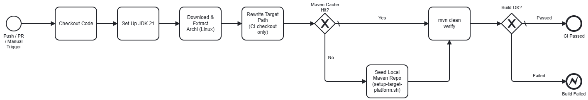
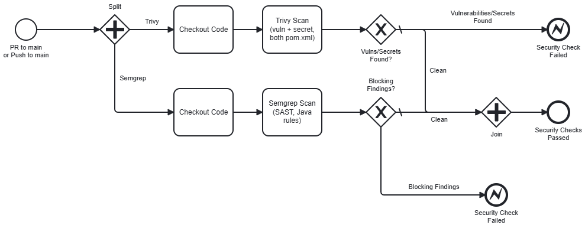
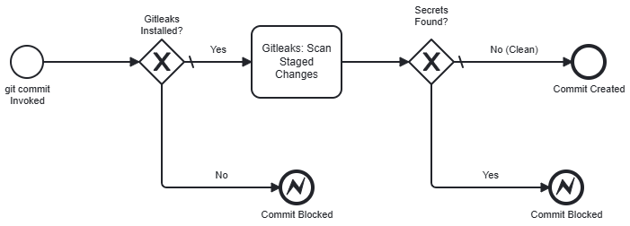

# Archi MCP Plugin — CI/CD Pipeline

What runs on every push/PR, and what runs locally before a commit even happens.

## At a glance

| Workflow | Triggers | What it does |
|---|---|---|
| [`ci.yml`](../.github/workflows/ci.yml) | `push` (any branch), `pull_request` (`opened`/`synchronize`/`reopened` → `main`), `workflow_dispatch` | Downloads Archi, seeds the local Maven repo, `mvn clean verify` |
| [`security.yml`](../.github/workflows/security.yml) | `pull_request` (→ `main`), `push` (`main`), `workflow_dispatch` | Trivy (dependency + secret scan), Semgrep (SAST) |
| [`dependabot.yml`](../.github/dependabot.yml) | weekly schedule | Version-update PRs for Maven deps + GitHub Actions |
| `.pre-commit-config.yaml` | every local `git commit` (once installed) | `gitleaks` secret scan before the commit even happens |

## Tools used

- **[Trivy](https://trivy.dev/)** — open-source scanner for dependency vulnerabilities, misconfigurations, and secrets. **TL;DR:** checks both `pom.xml` files for known-CVE Maven dependencies and scans the repo for leaked credentials, in `security.yml`.
- **[Semgrep](https://semgrep.dev/)** — static analysis (SAST) engine that pattern-matches source code for bugs and vulnerability-prone code without running it. **TL;DR:** free Community Edition rules catch things like the permissive-CORS issue found and fixed in this repo (see Findings below), in `security.yml`.
- **[pre-commit](https://pre-commit.com/)** — the Python framework that wires up this repo's local git hooks (not Husky — this repo has no `package.json` for Husky's npm-lifecycle auto-install trick to hook into). **TL;DR:** runs `gitleaks` against staged changes before every local commit.
- **[Gitleaks](https://github.com/gitleaks/gitleaks)** — the actual secret-scanning engine both Trivy's `secret` scanner and the local `pre-commit` hook are checking for. **TL;DR:** pattern-matches staged/repo content for things that look like API keys, tokens, and credentials.

## `ci.yml` — build



*(Source: [`pipelines/ci-pipeline.bpmn`](./pipelines/ci-pipeline.bpmn) — open in the Modeler to edit.)*

This repo had **no CI at all** before this work, and the build has a real blocker most Eclipse/Tycho projects don't: the target platform (`target-platform/archi-mcp.target`) points at a real, locally-installed copy of Archi rather than a p2 repository, because Archi itself isn't published anywhere Tycho can resolve it from automatically.

**Steps:**
1. Checkout, set up JDK 21.
2. Download and extract Archi's Linux tarball (pinned version, from `archimatetool/archi.io`'s GitHub releases).
3. Rewrite the target file's `<location path="...">` to point at the extracted path — **in the CI checkout only, never committed.**
4. Cache the local Maven repository, keyed on the pinned Archi version.
5. On a cache miss, run `scripts/setup-target-platform.sh` to seed that cache from the downloaded Archi's bundles.
6. `mvn -B clean verify`.

**Why the path gets rewritten instead of using `-Darchi.dir`:** the README documents `-Darchi.dir=<path>` as a override, but it's not actually wired to anything — verified directly by running `mvn clean verify -Darchi.dir=...` locally and confirming the build only succeeded because the tracked path happened to already match this machine's install location. There's no `<profiles>` block in `pom.xml` consuming that property. The real, current, documented local workflow is hand-editing the tracked file before every build — CI can't do that permanently, so it patches its own checkout instead, leaving the tracked file (and your local workflow) untouched.

**Why the cache matters — a lot:** `scripts/setup-target-platform.sh` shells out to a brand-new `mvn install:install-file` subprocess for *every single bundle* in Archi's `plugins/` directory — hundreds of them, sequentially, no batching. That's a confirmed ~10–20+ minute cost from a cold cache, dominated by repeated Maven JVM boot overhead rather than real work. Once the local repo is warm, an actual `mvn clean verify` completed in **under 30 seconds** in local testing. The cache, keyed on the Archi version, is what keeps every run after the first fast — bump the pinned `ARCHI_VERSION` and the next run re-seeds; otherwise it stays warm indefinitely.

**No dedicated test step** — there's no JUnit/`tycho-surefire-plugin` setup in this project yet, so `verify`'s test phase currently just reports zero rather than failing. Adding a real test suite is tracked as separate future work.

## `security.yml` — scans



*(Source: [`pipelines/security-pipeline.bpmn`](./pipelines/security-pipeline.bpmn).)*

Same Trivy + Semgrep pattern as `camunda-mcp` (this plugin's sister project), adapted for a Maven/Java stack:

- **Trivy**: `scan-type: fs`, `scanners: vuln,secret`, checks both `pom.xml` files (root + `za.co.jesseleresche.archi.mcp`) for known-CVE Maven dependencies and scans the whole repo for secrets. `GITHUB_TOKEN` is passed into the step's env to authenticate the `trivy-db` pull from GHCR and avoid anonymous rate limiting.
- **Semgrep CE**: `semgrep scan --config auto --error`, free community rulesets including Java-specific rules, no token needed.

**Why Semgrep instead of CodeQL:** CodeQL requires a paid GitHub Advanced Security license on private repos; Semgrep CE is free regardless of visibility.

**Triggers deliberately don't include bare feature-branch pushes** — same reasoning as `camunda-mcp`: both scans are slow relative to a quick feedback loop, so they're gated on PR events and pushes to `main`, not every WIP commit. This matters even more here given how much slower a cold-cache `ci.yml` run already is.

## Supply-chain hardening: actions pinned to commit SHAs

Every `uses:` step is pinned to a full commit SHA (with the version as a trailing comment) rather than a mutable tag like `@v4` — done from the start this time, since `camunda-mcp` only learned the hard way (via Semgrep flagging it after the fact) that a tag can be silently repointed by a compromised maintainer account, which is exactly what's happened in real supply-chain incidents affecting `tj-actions` and `trivy-action` itself.

## Concurrency: avoiding duplicate runs

Same SHA-keyed `concurrency` group pattern as `camunda-mcp`: a push to a branch with an open PR fires both a `push` event and a `pull_request:synchronize` event for the same commit, which would otherwise run each workflow twice. Grouping by `github.event.pull_request.head.sha` (falling back to `github.sha` for push/`workflow_dispatch`) and `cancel-in-progress: true` collapses that into one run.

## Pre-commit hook



*(Source: [`pipelines/pre-commit-hook.bpmn`](./pipelines/pre-commit-hook.bpmn).)*

`.pre-commit-config.yaml` defines a single local hook: `gitleaks git --pre-commit --redact --staged --verbose`, scanning only what's actually staged. It uses `language: system` — meaning it calls whatever `gitleaks` binary is already on your `PATH`, rather than building it from source (`language: golang`) or pulling a container image (`gitleaks-docker`) on every run.

**Setup (once per clone):**
```bash
pip install pre-commit
pre-commit install
```

**Important difference from `camunda-mcp`'s Husky setup:** Husky auto-installs itself for every developer via npm's `prepare` lifecycle script — nobody has to remember a setup step. There's no equivalent here, since this repo has no `package.json`/npm lifecycle to hook into. **Every contributor needs to run the two commands above manually, once** — it isn't automatic, and there's nothing enforcing that someone actually does it. See `CONTRIBUTING.md` for the documented setup step.

No Maven-based check runs locally — even a warm `mvn clean verify` isn't fast enough for commit-time, and Trivy/Semgrep stay CI-only for the same speed reason.

## Findings from the first real runs

Running the new pipeline for real surfaced one genuine, exploitable vulnerability:

**Semgrep flagged 6 `permissive-cors` findings across 4 files** — every HTTP handler in `za.co.jesseleresche.archi.mcp.transport` set `Access-Control-Allow-Origin: *`. Investigated before fixing: this plugin's HTTP server binds to `127.0.0.1` only, but that protects against *remote* attackers, not a malicious webpage running in the user's own browser — browser JavaScript on any site the user visits can still reach `localhost`. Combined with **zero authentication anywhere in the codebase** (confirmed by search) and `StreamableTransportHandler`'s (`POST /mcp`) full CORS preflight support, this meant any website visited while Archi was running could silently invoke MCP tools against the user's open model and read the results — a real, known class of vulnerability (CORS-driven attacks against localhost servers), not a false positive.

Checked whether removing it would break anything first: none of the three documented/supported clients (Claude Code, VS Code Copilot, Copilot Studio) are browser-JavaScript callers — Claude Code is a CLI, VS Code Copilot runs in the extension host, and Copilot Studio's own discovery mechanism (per `OpenApiHandler`'s doc comment) is a cloud-backend-to-server call, not browser JS. CORS only ever gates browser-JS callers, so none of them were affected. Fixed by removing the header from all 4 files (`HealthHandler`, `OpenApiHandler`, `SseTransportHandler`, `StreamableTransportHandler`) rather than restricting it to a specific origin, since no legitimate caller needs it at all.

**Trivy came back clean** — 0 vulnerabilities in either `pom.xml`.

## Considerations / possible follow-ups

- **The CI-side path rewrite is a pragmatic fix, not the long-term one.** The proper fix is generalizing the same substitution logic into a small setup script both local devs and CI call against a tracked *template* target file, replacing the current hand-edit-per-machine model. Same underlying mechanism, not a large separate effort — tracked as follow-up work, not blocking.
- **Parallelizing `scripts/setup-target-platform.sh`** (one `mvn install:install-file` subprocess per bundle, sequential) was investigated — genuinely parallelizable with no ordering dependency between bundles, using `xargs -P` with `mktemp`-based temp files instead of the current `$$`-based ones (which can collide under concurrent execution) — but not implemented yet, pending further testing.
- **No real test suite yet** (JUnit + `tycho-surefire-plugin`) — tracked as separate future work.
